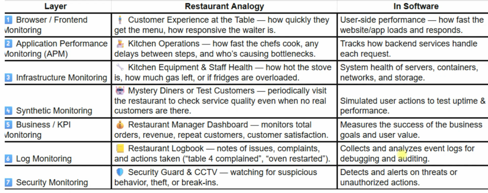

### 1. The layer of monitoring

- There are 7 common layers of monitoring:
  - 1 Browser/ Frontend Monitoring
  - 2 Application Performance Monitoring (APM)
  - 3 Infrastructure monitoring
  - 4 Synthetic monitoring
  - +++++++++++++++++++
  - 5 Business/ KPI monitoring
  - 6 Log monitoring
  - 7 Security Monitoring

- Take example:
- APM = database, backend
- Infras monitoring => CPU, memory, disk, port 
- Synthetic monitoring => simulate user actions-> test uptime -> write some script to check service work properly
- Log monitoring -> server or service gen logs 
- security monitoring -> firewall, package, ...

### 2. Key metric

- Response time
- Throughtput
- Error rate
- Database query Performance
- External API latency
- End-to-end tracing
- ++++++++++++++++++
- CPU, Memory, Disk, network usage
- node health, uptime
- pod/container status (Kubernetes)

### 3. Tool

- New relic
- Datadog APM
- AppDynamics
- Dynatrace
- Elastic APM
- eX: trace api latency from Nginx -> java -> my sql
- =================
- Prometheus + Grafana
- CLoudwatch
- Datadog 
- Zabbix
- Nagios

### 4. Log monitoring

- Error frequency
- Request logs
- Authentication failures
- With
- ELK stack
- Loki + Grafana
- Splunk
- Cloudwatch logs

### 5. Security monitoring

- Fail login spikes
- Suspicious ip/ geo access
- Privilege escalation events
- Vulnerability scan findings
- IDS/ÍP alerts
- With
- ELK stack
- Loki + Grafana
- Splunk
- Cloudwatch logs

### 6. Pillars of observability

- Metric
- Logs
- Traces
- Events Changes

### 7. The fours Golden Signals

- Latency
- Traffic
- Errors
- Saturation

- 8. Some monitoring Tools

- Prometheus:
  - Prometheus has its own query language, PromQL, which you use to get the information from Prometheus. You can integrate Prometheus with Alertmanager to send notifications. However, Grafana is often used for visualization and alerting integration, and we are going to use Grafana integrated with Alertmanager.
  - Prometheus is ideal for any cloud-native application, especially Kubernetes. You can monitor Kubernetes, you can run Prometheus on Kubernetes. Kubernetes monitoring covers pods, containers, and infrastructure monitoring — many different kinds of monitoring you can achieve with Prometheus.

- Grafana:
  - Grafana provides the fancy visualization you likely imagined — charts, graphs, and notification alerts. It is an open source dashboard and visualization tool. Grafana can connect to Prometheus and Loki (which we will discuss) and many other data sources. It can fetch information from these monitoring and logging tools and create panels, graphs, and other visualizations.
  

- This setup im following with -> sample