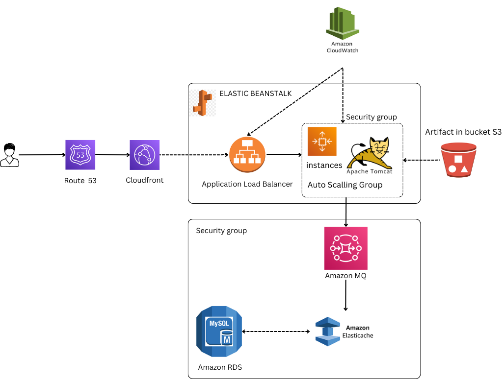

### Demo project re-architecting to AWS app-web 

Todo:
1. create key pair for beanstalk instance login
2. create Security group for elastic-cache, RDS, ActiveMQ
3. create elastic BeanStalk environment
4. update Security group of backend to allow traffic from Bean SG
5. update SG of backend to allow internal traffic 
6. launch EC2 instance for DB-initializing
7. Login to the instance and init RDS - DB
8. change health/check on beanstalk to /login 
9. add 443 https listener to ELB
10. build artifact with backend information
11. deploy Artifact to Beanstalk
12. Create CDN with SSL certificate
13. Update entry in GoDaddy DNS Zone
14. Test URL

#### The main architecture
